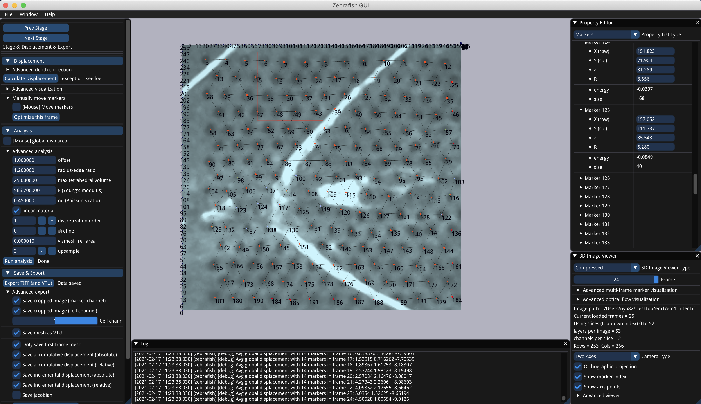

<!-- PROJECT LOGO -->
<br />
<p align="center">

  <h1 align="center"><a href="...">Zebrafish: 3D Traction Force Microscopy</a></h1>

  <a>
    
  </a>

  <p align="center">
    Publish info, date.
  </p>

  <p align="center">
    <a href='...'>
      
    </a>
  </p>
</p>

<br />
<br />


<br />
<br />

This repository contains a sample implementation of our algorithm to compute traction stresses. Please refer to the technical supplemental material for the detailed description and pseudo-code of our algorithm.



### Installing

```bash
mkdir build
cd build
cmake ..
make -j
```

The executables under the `resources` folder are compiled with Clang12 under both MacOS High Sierra and Ubuntu 2004.
## Dependencies

This implementation mainly relies on the following code bases or tools. CMake should automatically download all external dependencies.
- CLI11: IO support
- Libigl, Eigen: basic routines
- TinyTIFF: TIFF image format support
- Hypre: linear system solver
- LBFGS++: optimization implementation
- tbb: cross-platform parallel computing support

## Repository structure

The `Cpp` folder contains the implementation of our algorithm and the corresponding user interface design:
- `gui`: contains the design of the GUI interface.
- `test`: contains the tests and experiments during development. Some functions are out of date.
- `main_gui.cpp`: the entry point of the GUI.

The `MatlabScripts` folder contains the development and test code in MATLAB.

The `Analysis` folder contains the post-analysis code. It takes the displacement as input and computes the desired forces or stresses.

The `tests` folder contains the unit test of essential components.
